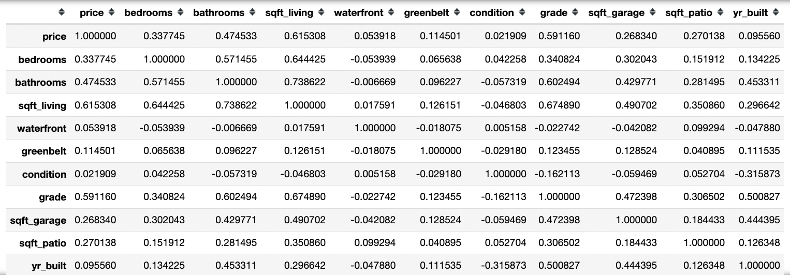
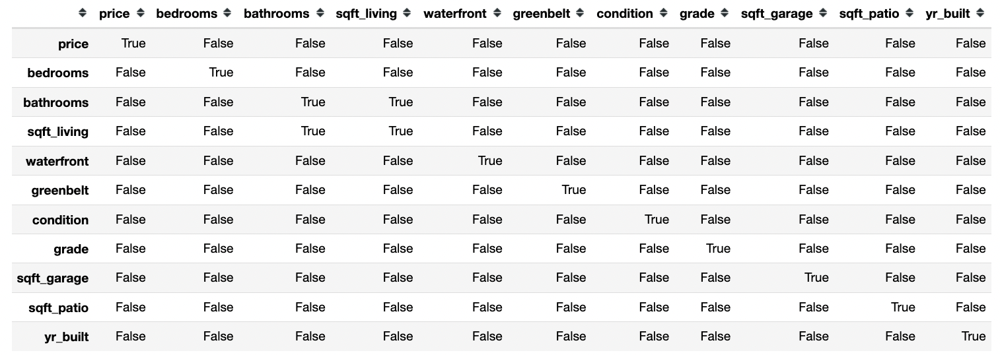
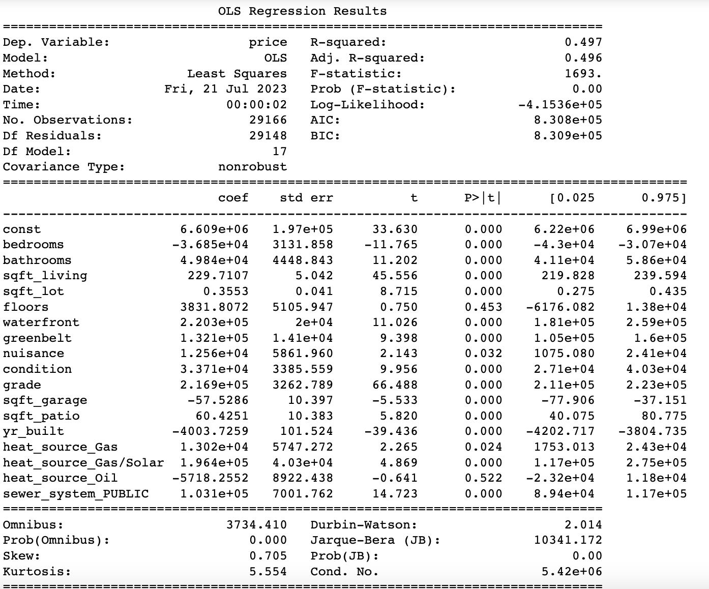
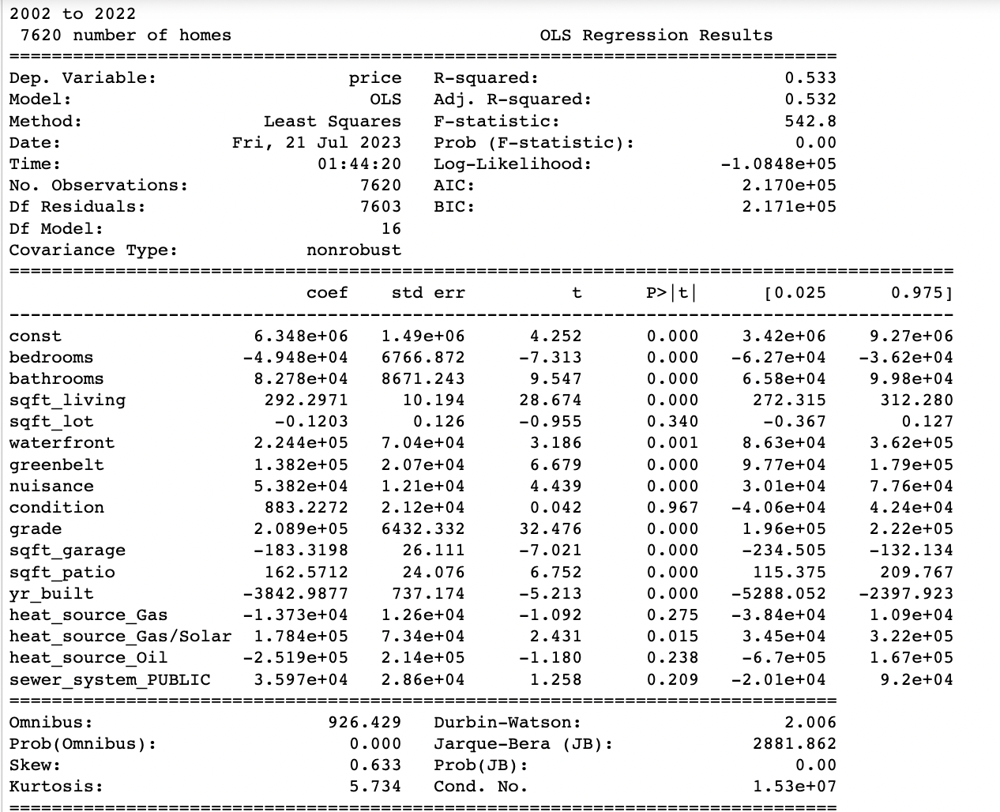
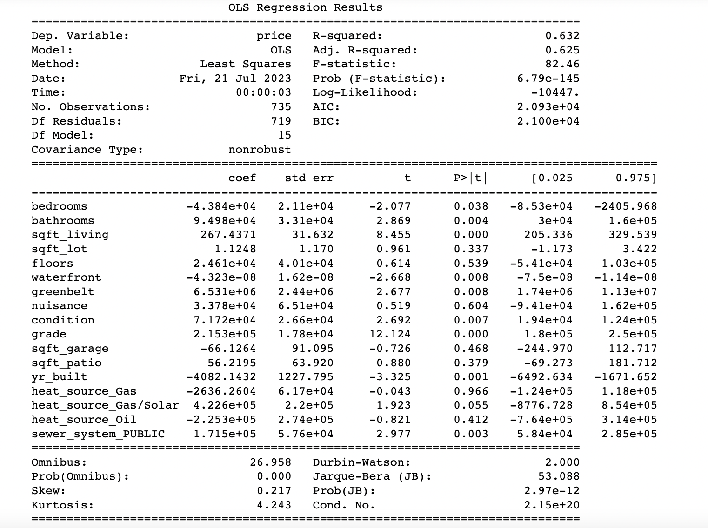
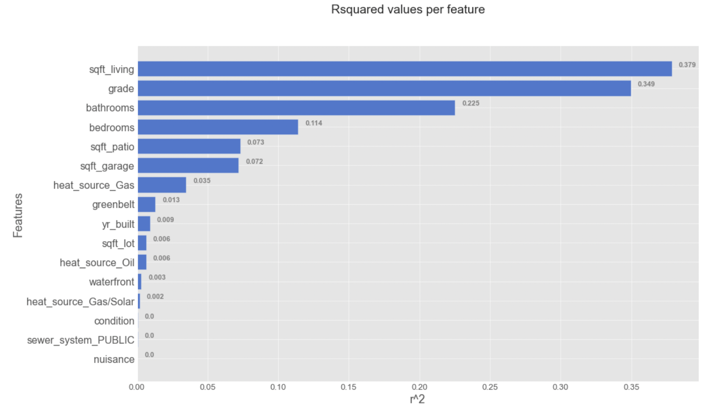

# Kings County Home Assessments

**Author**: [Ferdinand Beaman](mailto:ferdinand.beaman@gmail.com)

## Overview

This project analyzes the the homes sold in King's County Seattle in an effort to direct a renovation company in how they should project the value of their work to customers.

## Business Problem

Beyond merely wanting a more comfortable living space, customers may want to perform renovations on homes in order to increase their value on the open market. This is where we are going to focus our efforts: What kind of work can be done to best increase the value of a home, while also remaining realistic?

## Data

Over 30,000 homes were analyzed, and various features of those homes were provided by Kings County ranging from the age of the house all the way down to the kind of heating it has. Explanations for those features can be found in the data folder. 

## Methods

This project makes heavy use OLS regression, including attempts to transform the data in various ways, such as through log transformation and higher order regressions. This provides a way to ascertain what features are most relevant when predicting a prospective sale price in the near future. The adjusted R squared values explain how much of the variability in price (the dependent variable) can be explained by the independent variables (such as the number of bedrooms, or square footage of the house).

The assumptions for OLS were all tested (independence, normal distribution of residuals, homoschedasticity, linearity), with varying results. Every independant variable failed the linearity tests. Every one passed the test for homoschedasticity. Living room size was the only failure in the normality test. And, as seen below, only the bathrooms+living room pair failed the independence test (having a correlation coefficient with a greater absolute value than 0.7). It may be worth mentioning that several other pairs approached that suggested threshold.

Correlation coefficients

Same as above, but boolean

## Results

Presumably, without better location data, the predictive power of the data that was analyzed is somwhat weak, with the best models approaching 50% explanatory power. However,  houses increase by about 300,000 dollars with every increase in the independent variable "grade", and grade itself in a naive model which takes only it as an independant variable explains about 35% of the variability in price.

The amount of money explained by each feature is described by the value under "coef" below, and the percentage of the model's explanatory power is adjusted R squared (in decimal form)

Interestingly, the model's predictive capability increased slightly for newer homes.

For the 599 homes in a greenbelt area, the model's capability to explain prices jumped to over 60%.

Installing a new bathroom also seems to raise a home's value by 49,000 dollars.

Here are the rsquared values for each independent variable measured in isolation:

## Conclusions

This analysis leads to one strong and one soft recommendation for the client:

- **Focus on renovations that will increase the "grade" of the home** While vague, this was the primary way to increase a home's value without extensive work, such as would be the case if the living room would be extended into property that doesn't have foundation underneath it yet.
- **If feasible, installing a new bathroom may not be a bad idea.** I have a limited but nonzero amount of experience in this field, but I believe small bathrooms can be installed in some houses under some circumstances reasonably.

### Next Steps

Additional insight could be found if we had:

- **Better understanding of the "grade" metric.** It is unclear even at info.kingcounty.gov what factors go into "grade".
- **Better location data.** Latitude and longitude are not useful without a map, if even then. Specific neighborhood information would be very useful.
